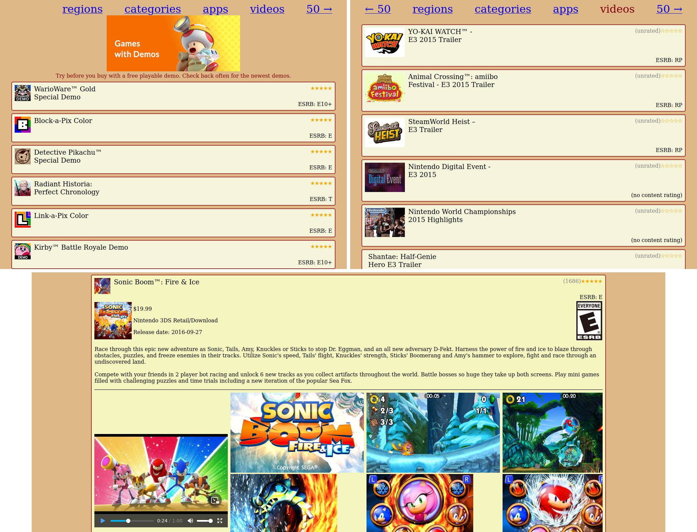

# saveShop

The eShop for the 3DS and Wii U is closing down on 27 March 2023. Let's save it!

saveShop is a PC tool that scrapes the eShop for metadata and media files (screenshots/videos).
A web-based game list is included to explore the scraped data.



## Why?

The data presented on the eShop provides historical context to games that you wouldn't find by just
playing them, such as game descriptions, trailers, user-ratings, and more.

These things present interesting background to a game's release:
* What features were considered innovative at the time? What catch-phrases did the developers highlight?
* What screenshots and trailers were released alongside the game release to show off the game's strengths?
* Did the gaming community welcome or reject the title at the time? How widely was it played?

Sadly, for one reason or another, many preservation communities don't bother archiving this
historical context. It would be a shame to lose it just because its significance wasn't widely
understood at the time. With saveShop, your own personal archive is in close reach!

## Legal disclaimer

This tool cannot be used to download games. The authors of this tool do not host public archives.

Use of this tool may be subject to legislation in your country and/or the country the accessed
servers reside in. Terms of service may apply. Text and data mining may be considered legal for
the purposes of pattern and trend analysis, but speak to your lawyer if in doubt about your
legal situation.

## Build & Usage

The Rust package manager Cargo is required to build saveShop. Run the following for usage instructions:
```sh
cargo run -- --help
```

For most subcommands, the server region(s) to fetch data from must be specified using `--regions`.

For full metadata access, you will need to provide the 3DS client certificate (see below).
If video data is dumped (`fetch-media --fetch-videos`), `saveShop` can auto-convert moflex videos
to mp4 using the `convert-media` subcommand (requires FFmpeg to be installed).

Incomplete runs can be resumed, but the initial rescan will take some time.

## Extract 3DS client certificate

The 3DS client certificate ("ClCertA") is required to access metadata from Ninja servers.
The certificate can be dumped in either of three ways. In all cases, the certificate must be
converted to PEM format after dumping.

### Option 1: Dump fully decrypted certificate from a 3DS using ccrypt

The most convenient option to dump the certificate is to run [ccrypt](https://github.com/SciresM/ccrypt) on a 3DS.

### Option 2: Dump certificate from a 3DS

Using GodMode9, navigate to `CTRNAND/title/0004001b/00010002/content/00000000.app`, select
`NCCH image options` and then `Mount image to drive`. Enter the `romfs` directory in the mounted
image. You should see two files, `ctr-common-1-cert.bin` and `ctr-common-1-key.bin`. Copy each file
to the SD card and transfer it to a PC.

These files are AES encrypted using 3DS key slot 0xd. This is the same key you'd put into the
slot0x0DKeyN line of an `aes_keys.txt` file used by Citra. To decrypt the data on PC, run these
commands (where `<aeskey_0x0d>` must be replaced with the 32-hex-digit AES key):
```sh
dd if=ctr-common-1-cert.bin of=ctr-common-1-cert.bin.iv bs=1 count=16
dd if=ctr-common-1-cert.bin of=ctr-common-1-cert.bin.contents bs=1 skip=16
dd if=ctr-common-1-key.bin of=ctr-common-1-key.bin.iv bs=1 count=16
dd if=ctr-common-1-key.bin of=ctr-common-1-key.bin.contents bs=1 skip=16
openssl enc -aes-128-cbc -nosalt -d -in ctr-common-1-cert.bin.contents -K <aeskey_0x0d> -iv `xxd -p ctr-common-1-cert.bin.iv` > ctr-common-1-cert.dec
openssl enc -aes-128-cbc -nosalt -d -in ctr-common-1-key.bin.contents -K <aeskey_0x0d> -iv `xxd -p ctr-common-1-key.bin.iv` > ctr-common-1-key.dec
```

### Option 3: Dump certificate from NUS

It's assumed you know what you're doing here. Don't forget to decrypt the data using the CLCertA's
title key. Like in Option 2, this data must additionally be decrypted with AES key 0xd.

### After dumping the certificate: Converting to PEM format

First, ensure the dumping process was successful using:
```
curl --cert-type DER --key-type DER --cert ctr-common-1-cert.dec --key ctr-common-1-key.dec --insecure https://ninja.ctr.shop.nintendo.net/ninja/ws/country/US
```

Then, combine the two decrypted files into a single PEM file:
```
openssl x509 -in ctr-common-1-cert.dec -inform DER -out ctr-common-1-cert.pem -outform PEM
openssl rsa -in ctr-common-1-key.dec -inform DER -out ctr-common-1-key.pem -outform PEM
cat ctr-common-1-cert.pem ctr-common-1-key.pem > ctr-common-1.pem
rm ctr-common-1-cert.pem ctr-common-1-key.pem
```

Again verify everything went smoothly using:
```
curl --cert ctr-common-1.pem --insecure https://ninja.ctr.shop.nintendo.net/ninja/ws/country/US
```

You can now pass this certificate to saveShop using the `--cert` option.

## Viewing results

A web-app is included to explore scraped contents. Copy `index.html` to the directory you ran
`saveShop` in and open a local HTTP server (e.g. by running `python3 -m http.server`). You should
then be able to view the data by navigating to `localhost:8000` in your web browser.

## TODO

* Improve Wii U eShop scraping
